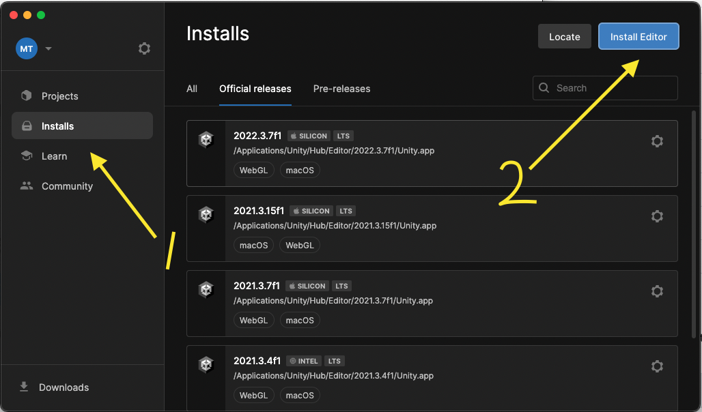

# CSC 496/696-002 Computational Art | Spring 2024
## *Professor Mike Treanor, PhD, MFA*

## Dates
1/16/2024 - 5/8/2024

Monday and Thursday 11:20 AM - 12:35 PM

Myers Building 114

## Office Hours

Monday: 1:00 - 2:30pm (please email indicating that you want to come)

Don Myers Building - 108C

## Description
This course surveys a variety of tools and techniques used for creating artworks enabled by computation. Topics include physical simulation, live coding for audio and visuals, game programming, etc. Students create several creative programming projects using a variety of programming languages, as well as an online portfolio.

<!--  -->

<!--  -->

## Assignments

| Assignment | Due |
| --- | --- |
| 1. [Github Configuration, and a work of abstract art using p5](./assignments/p5-setup-abstract.html) | 1-29-24 |
| 2. [Noise](./assignments/noise.html) | 2-8-24 |
| 3. [Physics](./assignments/physics.html) | 2-19-24 |
| 4. [Particles](./assignments/particles.html) | 2-26-24 |
| 5. [Grid](./assignments/grid.html) | 2-29-24 |

## Examples

| Date | Topic | Example |
| --- | --- | --- |
| 1-22-24 | Introduction to p5 and classes | [view](./examples/1-22-24) / [code](https://github.com/mtreanor/computational-art-spring2024/blob/main/examples/1-22-24/sketch.js) |
| 1-25-24 | Arrays of Objects, vectors, gravity, using array index to parameterize an object | [view](./examples/1-25-24) / [code](https://github.com/mtreanor/computational-art-spring2024/blob/main/examples/1-25-24/sketch.js) |
| 2-1-24 | Some examples of p5 functions. Perlin Noise pt. 1 | [view](./examples/2-1-24) / [code](https://github.com/mtreanor/computational-art-spring2024/blob/main/examples/2-1-24/sketch.js) |
| 2-5-24 | Perlin Noise pt. 2, and map() | [view](./examples/2-5-24) / [code](https://github.com/mtreanor/computational-art-spring2024/blob/main/examples/2-5-24/sketch.js) |
| 2-8-24 | Polar coordinates, spirals, noise, sliders | [view](./examples/2-8-24) / [code](https://github.com/mtreanor/computational-art-spring2024/blob/main/examples/2-8-24/sketch.js) |
| 2-12-24 | Dots with Gravity, arrays of objects, Physics simulation | [view](./examples/2-12-24) / [code](https://github.com/mtreanor/computational-art-spring2024/blob/main/examples/2-12-24/) |
| 2-15-24 | Dots in water (drag force) and spring forces! | [view](./examples/2-15-24) / [code](https://github.com/mtreanor/computational-art-spring2024/blob/main/examples/2-15-24/) |
| 2-19-24 | Particle Systems | [view](./examples/2-19-24) / [code](https://github.com/mtreanor/computational-art-spring2024/blob/main/examples/2-19-24/) |
| 2-26-24 | Grid | [view](./examples/2-26-24) / [code](https://github.com/mtreanor/computational-art-spring2024/blob/main/examples/2-26-24/) |
| 2-29-24 | Autonomous Agents pt 1. Computing a steering force and the seek target behavior | [view](./examples/2-29-24) / [code](https://github.com/mtreanor/computational-art-spring2024/blob/main/examples/2-29-24/) |

## Potential Topics

| --- |
| Digital media vs computational media |
| p5 - [Javascript and p5 basics](https://p5js.org/get-started/) |
| p5 - [Physics (vectors and forces)](https://natureofcode.com/) |
| p5 - [Autonomous Agents](https://natureofcode.com/) |
| p5 - [Graphics processing](https://natureofcode.com/) |
| livecoding - TBD (Hydra?) |
| images - [Context Free Art](https://www.contextfreeart.org/) |
| text - [RiTa](https://rednoise.org/rita/) (NLP/NLG) |
| text - [Tracery](https://github.com/galaxykate/tracery) (NLG) |
| music - [VCV Rack](https://vcvrack.com/Rack) |
| music - [Orca](https://100r.co/site/orca.html) |
| music - [Teletype](https://library.vcvrack.com/monome/teletype) |
| games - [PICO-8](https://www.lexaloffle.com/pico-8.php) (Fantasy Game Console) |